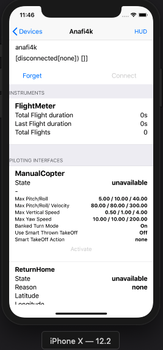

.. _pod install:

Install with pods
=================

*CocoaPods is a dependency manager for Swift and Objective-C Cocoa
projects. It has over 30 thousand libraries and is used in over 1.9
million apps. CocoaPods can help you scale your projects
elegantly.* https://cocoapods.org

Pods : GroundSdk, ArsdkEngine, SdkCore
--------------------------------------

GroundSdk for iOS mobile applications provides three Pods that can
quickly and easily set up any application.

**GroundSdk**: Parrot Drone SDK - Hi-Level API

**ArsdkEngine**: Parrot Drone SDK, arsdk based engine

**SdkCore**: Parrot Drone SDK, low level implementation (pre-compiled
framework).

.. note:: The use of Pods allows you to include only the source of the APIs
    of GroundSdk iOS and to use a pre-compiled version of all other
    libraries (Pod SdkCore). These libraries are also provided in Open
    Source and it is also possible to install a full version of groundSdk
    with all sources (see the corresponding installation guide).

Use Pods in the demo app or in your project
-------------------------------------------

Getting Started
^^^^^^^^^^^^^^^

You first need to install CocoaPods.

CocoaPods is built with Ruby and it will be installable with the default
Ruby available on macOS. You can use a Ruby Version manager, however we
recommend that you use the standard Ruby available on macOS unless you
know what you're doing.

Using the default Ruby install will require you to use sudo when
installing gems. (This is only an issue for the duration of the gem
installation, though.)

.. code-block:: console

    $ sudo gem install cocoapods

Install the GroundSdk Demo App and Pods
^^^^^^^^^^^^^^^^^^^^^^^^^^^^^^^^^^^^^^^

Clone the demo:

.. code-block:: console

    $ git clone https://github.com/Parrot-Developers/pod_groundsdk_demo.git

Or download the zip file:

https://github.com/Parrot-Developers/pod_groundsdk_demo/archive/master.zip

Open Terminal and navigate to the directory that contains
your pod_groundsdk_demo by using the cd command:

.. code-block:: console

    $ cd ~/Path/To/Folder/Containing/pod_groundsdk_demo

Enter the command (be sure to close Xcode before)

.. code-block:: console

    $ pod install

Now, you can open the **groundSdkDemo** with the Xcode workspace:
*GroundSdkDemo.xcworkspace*

|image0|

Adding Parrot Sdk Pods from in a fresh Xcode project
^^^^^^^^^^^^^^^^^^^^^^^^^^^^^^^^^^^^^^^^^^^^^^^^^^^^

You first need to close Xcode.

Open Terminal and navigate to the directory that contains
your appProject by using the cd command:

.. code-block:: console

    $ cd ~/Path/To/Folder/Containing/appProject

Next, enter the following command:

.. code-block:: console

    $ pod init

This creates
a \ `Podfile <https://guides.cocoapods.org/using/the-podfile.html>`__ for
your project.

Open the Podfile using Xcode for
editing:

.. code-block:: console

    $ open -a Xcode Podfile

Replace all content with:

.. code-block:: console

    platform :ios, '10.0'

    target ' appProject ' do
        use_frameworks!
        pod 'GroundSdk', '1.0.0'
        pod 'ArsdkEngine', '1.0.0'
        pod 'SdkCore', '1.0.0'
    end

Save and close the Podfile.

You now need to tell CocoaPods to install the dependencies for your
project. Enter the following command in Terminal, after ensuring you’re
still in the directory containing the appProject project and Podfile:

.. code-block:: console

    $ pod install

**Open the project folder using Finder, and you’ll see CocoaPods created
a new appProject.xcworkspace file and a Pods folder !**

